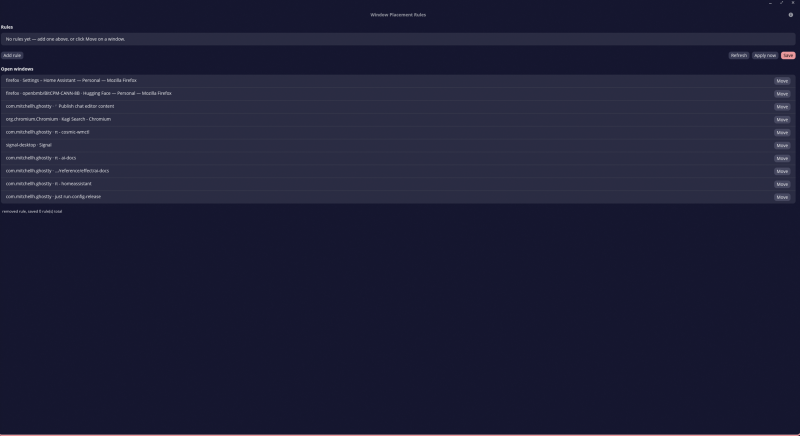

# `cosmic-wmctl`

Small CLI for inspecting COSMIC windows/workspaces, moving a window to a workspace, and automatically placing newly opened windows (launch-time rules).

## Features

- List current workspaces with names, ids, coordinates, and outputs.
- List current windows with title, app id, identifier, current workspace, and outputs.
- Move a window to a target workspace with either exact or fuzzy matching.
- Activate (focus) a window or a workspace.
- **`launch`**: start a command and move its window to a workspace as soon as it opens.
- **`run`**: start a command on a specific workspace.
- **`daemon`**: watch for new windows and move them per rules in a config file — anything you start, wherever you start it from.
- **`debug-capabilities`**: print the runtime Wayland globals and COSMIC toplevel capabilities, to diagnose missing features.
- `--json` output on `windows`/`workspaces` for scripting.

## Requirements

- A running COSMIC session on Wayland.
- `ext_workspace_manager_v1` plus `zcosmic_workspace_manager_v2` for workspace discovery.
- `zcosmic_toplevel_manager_v1` with the `move_to_ext_workspace` capability for `window-move`.

If your COSMIC build exposes workspaces but does not advertise `move_to_ext_workspace`, the CLI can still inspect windows and workspaces, but `window-move` will fail with a clear runtime error.

## Build

```bash
cargo build
```

Builds the `cosmic-wmctl` CLI. The `cosmic-wmctl-config` GUI is a separate
workspace member (`cargo build -p cosmic-wmctl-config`). The repository is
self-contained: the vendored `cosmic-protocols` toolkit lives under
`vendor/`.

## Install

```bash
just install        # binaries, desktop entry and systemd unit to ~/.local
```

(Override the destination with `prefix=/usr just install`.) Enable the rules
daemon at login:

```bash
systemctl --user enable --now cosmic-wmctl
```

## Usage

```bash
cosmic-wmctl workspaces
cosmic-wmctl windows
cosmic-wmctl window-move 'app_id=firefox' '6'
cosmic-wmctl window-move 'title=Mozilla Firefox' '2' --dry-run
cosmic-wmctl window-activate 'app_id=org.gnome.Terminal'
cosmic-wmctl workspace-activate '6'
cosmic-wmctl launch --workspace 2 --app-id '*firefox*' -- firefox
cosmic-wmctl run --workspace 2 -- gimp
```

`windows` and `workspaces` accept `--json` for machine-readable output:

```bash
cosmic-wmctl windows --json
```

`window-move` also supports `--force-ext-move` to bypass capability checks entirely
(useful against `cosmic-comp` builds that only advertise the stale `MoveToWorkspace`
toplevel capability).

**Window queries** are `field=value` predicates joined with ` and `. Fields:
`app_id`, `title`, `identifier`, and `active=true|false`. A bare token matches
`app_id`. Matching is a case-insensitive substring by default; add `--exact`
to require an exact match.

**Workspace queries** are a bare id, name, or coordinates (e.g. `1,0`) — no
`field=value` form.

Diagnose your session with `cosmic-wmctl debug-capabilities`, which prints the
Wayland globals and COSMIC toplevel capabilities actually in effect.

## Automatic placement

### `launch` — place the window of a command you start

```bash
# Move the first window the launched app opens to workspace 2
cosmic-wmctl launch --workspace 2 -- gnome-terminal

# Only move the window if its app_id (and optionally title) match a glob
cosmic-wmctl launch --workspace 3 --app-id 'org.mozilla.firefox' -- firefox
cosmic-wmctl launch --workspace 4 --app-id 'com.slack.Slack' --title '*work*' -- slack
```

The command runs detached; `cosmic-wmctl` waits up to `--timeout` seconds (default 30)
for a matching window to appear and moves it. Without `--app-id`/`--title`, the first
window that opens after the launch is moved. Use `--return` to also wait for the
command to exit. `--dry-run` prints the intended move without sending it.

### `daemon` — rule-based placement for everything

Run once at session start (e.g. in COSMIC autostart):

```bash
cosmic-wmctl daemon
```

It watches for **new** windows and moves each one to the workspace of the first
matching rule. The rules file is **hot-reloaded** whenever it changes — edit it
by hand or with `cosmic-wmctl-config` and new windows immediately follow the
updated rules, no daemon restart needed. Set it up with:

```bash
cosmic-wmctl daemon --init        # writes an example ~/.config/cosmic-wmctl/rules.toml
```

Rules file (`~/.config/cosmic-wmctl/rules.toml`, override with `--config`):

```toml
[[rules]]
app_id = "org.mozilla.firefox"
workspace = "2"

[[rules]]
app_id = "org.gnome.Terminal"
title = "*htop*"
workspace = "3"

[[rules]]
app_id = "com.slack.Slack"
workspace = "4"
```

- `app_id` (required): glob matched against the window's app id, e.g. `org.mozilla.firefox`.
- `title` (optional): glob matched against the window's title.
- `workspace` (required): workspace name, id, or coordinates (e.g. `1,0`).

Windows already open when the daemon starts are left alone unless you pass
`--move-existing`. `--dry-run` prints the moves that would happen.

## Rules reference

Each `[[rules]]` entry describes one placement rule:

| field | required | meaning |
|---|---|---|
| `app_id` | yes | glob pattern matched against the window's app id, e.g. `firefox`, `com.mitchellh.ghostty` |
| `title` | no | glob pattern matched against the window's title; the rule only fires if both `app_id` and `title` match |
| `workspace` | yes | where to move it: workspace name, id, or coordinates (e.g. `"6"` or `"1,0"`) |

Glob syntax (globset, case-sensitive — dots are **literal**, not wildcards):

| pattern | matches |
|---|---|
| `*` | any sequence of characters (including none) |
| `?` | exactly one character |
| `[a-z0-9]` | one character from a set or range |
| `[!abc]` | any character not in the set |
| anything else | itself (`-`, `.`, spaces, letters) |

```toml
# every Firefox window
[[rules]]
app_id = "firefox"
workspace = "2"

# only Firefox DevTools windows
[[rules]]
app_id = "firefox"
title = "*DevTools*"
workspace = "5"

# a specific terminal (exact-equivalent when there are no wildcards)
[[rules]]
app_id = "com.mitchellh.ghostty"
title = "ingredients"
workspace = "3"
```

Two things that trip people up:

- **Use the real app_id.** What the compositor reports can differ from the
  desktop file name — `cargo run -- windows` lists the actual app_ids (e.g.
  `firefox`, not `org.mozilla.firefox`).
- **Titles settle after a window opens.** The daemon only matches a window
  during its first ~5 seconds of life, so `title` rules must match from
  startup (browser titles, IDEs). Per-app placement is more reliably done
  with `app_id` alone.

The GUI (`cosmic-wmctl-config`) shows the same reference in its **?** help popup.

## Notes on `run --workspace`

`run --workspace <query> -- <command...>` starts the command and moves its first
new window to the workspace — equivalent to `launch` without an app-id filter.

## Graphical configurator (`cosmic-wmctl-config`)



A small COSMIC app for editing the rules file and applying rules live. It shows
the real workspaces and open windows from your session, provides a picker to
fill in workspace selectors, and can apply a rule to currently open windows
without waiting for the daemon ("Apply now").

```bash
cargo run -p cosmic-wmctl-config
```

Both the CLI and the GUI write/read the same `rules.toml`, and the daemon
hot-reloads it — a save in the GUI takes effect immediately, no restart needed.

The GUI lives in its own workspace member and depends on the System76
`libcosmic` framework (`git = "https://github.com/pop-os/libcosmic"`), which is
not published on crates.io — the first build will clone it and its iced fork.

The app launcher entry, binaries and the daemon systemd unit are all installed
by `just install` (see [Install](#install)).


## License

MIT — see [LICENSE](LICENSE). The vendored `cosmic-protocols`
(`vendor/`) is System76's work, also MIT (upstream relicensed from
GPL-3.0-only to MIT in August 2026); our snapshot additionally includes a
local patch that promotes toplevels to the window list without waiting for
the compositor's `state` event.
